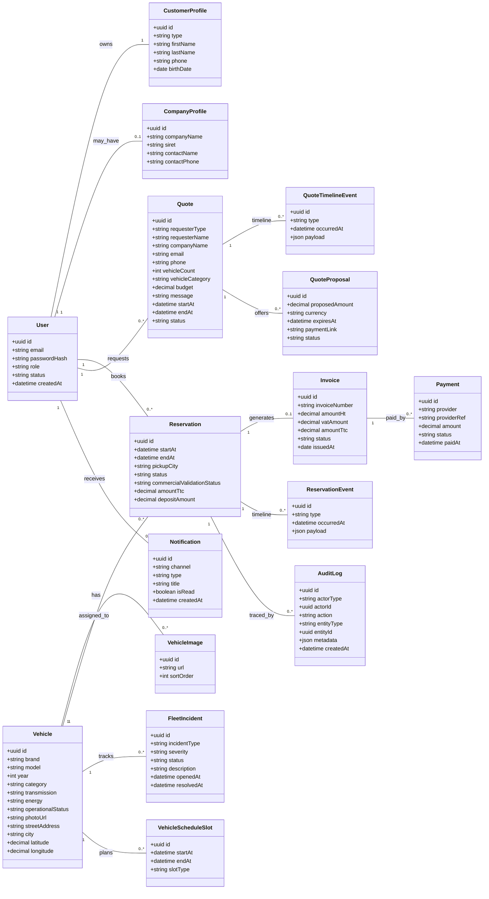
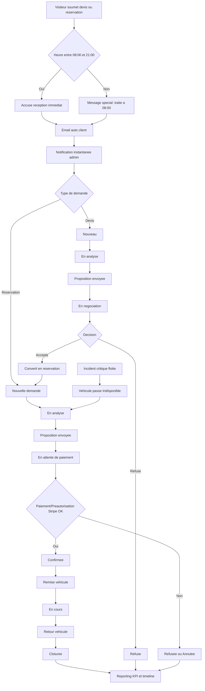
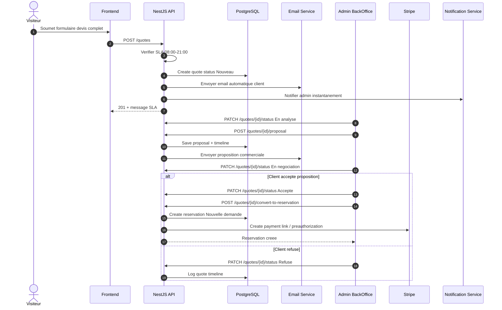
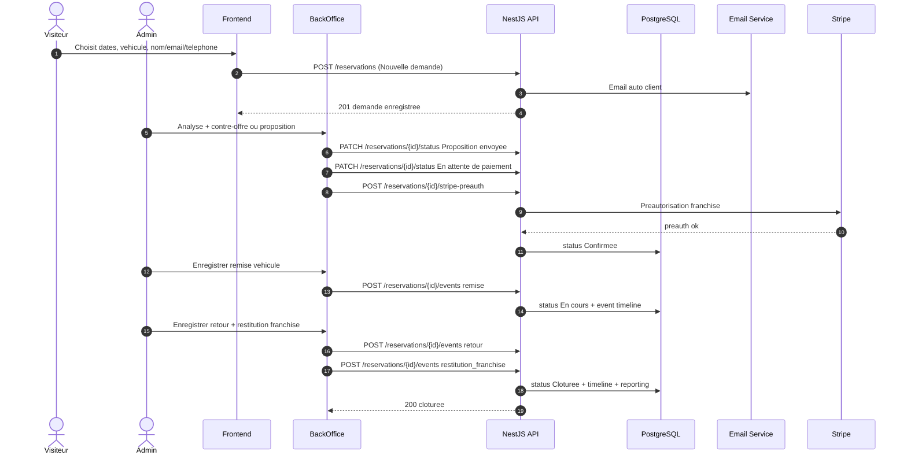

# WESTDRIVE - Blueprint Backend (Preparation)

Ce document est une base d'architecture backend pour rendre fonctionnel le frontend WestDrive (actuellement base de donnees mock/placeholder).

Objectif: fournir a un LLM d'implementation (Claude Sonnet 4.6) une specification claire et actionnable pour construire le backend sans ambiguite.

## 1) Contexte general / description du projet

WestDrive est une application web de location de vehicules B2C/B2B en Ile-de-France.

Le frontend expose deja les parcours metier suivants:
- Recherche de vehicules (ville, dates, categorie)
- Consultation details vehicule
- Reservation (particulier / entreprise)
- Demande de devis entreprise
- Authentification et espace client
- Espace admin (KPI, flotte, reservations, utilisateurs)

Le frontend est majoritairement alimente par des donnees mock. Le backend doit donc etre concu from scratch pour porter la logique metier, la persistence, la securite et l'observabilite.

## 2) Fonctionnalites cibles backend

### Noyau metier
- Gestion des utilisateurs: particulier, entreprise, roles admin internes.
- Gestion du parc vehicules: disponibilite, caracteristiques, media, statut exploitation.
- Gestion reservations: creation, validation, cycle de vie, annulation, cloture.
- Gestion devis: collecte, qualification, conversion en reservation.
- Gestion facturation: generation, calculs TTC, statut de paiement, export PDF.

### Devis (regles metier confirmees)
- SLA visible: reponse en moins de 1h entre 08:00 et 21:00.
- Formulaire devis complet: nom, societe, email, telephone, dates, type vehicule, nombre de vehicules, budget, message.
- Email automatique de prise en charge envoye au client.
- Notification instantanee cote admin.
- Si la demande arrive hors plage 08:00-21:00: message specifique de prise en charge a 08:00.
- Workflow devis: Visiteur -> Formulaire -> Email auto -> Analyse admin -> Proposition -> Paiement -> Conversion en reservation.
- Cycle de vie devis (obligatoire):
  - Nouveau
  - En analyse
  - Proposition envoyee
  - En negociation
  - Accepte
  - Refuse
  - Converti en reservation
- Gestion commerciale:
  - Envoi de proposition commerciale
  - Conversion directe en reservation
  - Timeline complete de tous les evenements

### Reservation (regles metier confirmees)
- SLA identique au devis (reponse < 1h entre 08:00 et 21:00).
- Parcours front: dates -> vehicule -> formulaire (nom, email, telephone) -> validation commerciale.
- Aucun prix public affiche cote front.
- Email automatique client apres soumission et notification admin instantanee.
- Statuts back-office reservation (obligatoires):
  - Nouvelle demande
  - En analyse
  - Proposition envoyee
  - En attente de paiement
  - Confirmee
  - En cours
  - Cloturee
  - Annulee
  - Refusee
- Actions back-office:
  - Modification dates/heures
  - Contre-offre
  - Preautorisation Stripe
- Evenements operationnels traces:
  - Remise vehicule
  - Retour vehicule
  - Depot franchise
  - Restitution franchise
- Tous les evenements doivent alimenter le reporting.

### Gestion de flotte (regles metier confirmees)
- CRUD vehicules.
- Calendrier de disponibilite precis (date + heure).
- Statuts operationnels vehicule:
  - Disponible
  - Indisponible
  - Maintenance
- Incidents (V2):
  - Types: dommage, panne, historique
  - Statuts: ouvert, en cours, resolu
  - Regle critique: incident critique => vehicule automatiquement indisponible
- Historique complet par vehicule (operations + incidents + maintenances).
- Donnees supplementaires obligatoires:
  - Photo vehicule
  - Adresse de stationnement (rue + ville)
  - Localisation carte (lat/lng)

### Support operationnel
- Notifications (email/SMS) sur transitions importantes.
- Dashboard admin/KPI (revenu, taux occupation, volume reservations).
- Traces d'audit pour actions sensibles (admin, permissions, suppression).

### Contraintes metier minimales
- Verification de disponibilite vehicule sur intervalle date/heure.
- Prevention du double booking.
- Gestion des statuts reservation: EN_ATTENTE, CONFIRMEE, EN_COURS, TERMINEE, ANNULEE.
- Segregation des acces par role (RBAC).

## 3) Choix techniques imposes

- Framework: NestJS
- ORM: TypeORM
- SGBD: PostgreSQL
- Conteneurisation: Docker

### Stack complementaire recommandee
- Auth: JWT access + refresh tokens
- Hash mots de passe: Argon2 (ou bcrypt)
- Validation: class-validator + class-transformer
- Documentation API: Swagger/OpenAPI
- Queue asynchrone: BullMQ (notifications, taches differees)
- Cache/anti-burst: Redis

## 4) Modele UML (Mermaid)

## 5) Diagramme de flow (Mermaid)

## 6) Diagrammes de sequences (Mermaid)

### Sequence A - Devis avec SLA, proposition et conversion

### Sequence B - Reservation complete jusqu'a cloture

## 7) Architecture logique backend (NestJS)

Modules proposes:
- auth: login/register/refresh/logout, password reset.
- users: profils, roles, permissions.
- vehicles: catalogue, disponibilite, media.
- fleet: calendrier date/heure, statuts operationnels, incidents.
- reservations: cycle de vie complet.
- quotes: demandes de devis et conversion.
- invoices: generation, calculs, exports.
- payments: integration PSP + webhooks.
- notifications: email/SMS + templates.
- admin: KPI, supervision, reporting.
- audit: journal d'actions sensibles.

Pattern recommande:
- Controller -> Service -> Repository (TypeORM)
- DTO stricts en entree/sortie
- Transactions DB pour operations critiques (reservation, facturation)
- Idempotency keys pour creations sensibles
- Timeline event sourcing leger pour devis et reservations (audit metier exploitable).

## 8) Securite (code + protection attaques web)

### Securite applicative (code secure)
- Validation stricte de tous les inputs (DTO + pipes globaux NestJS).
- Sanitization des champs texte (anti script injection stockee).
- Politique de secrets: variables d'environnement, jamais en dur.
- Hash mots de passe robuste + rotation token.
- Journalisation structuree sans fuite de donnees sensibles.
- Tests de securite sur parcours critiques (auth, reservation, admin).

### Protection attaques web
- SQL injection: requetes parametrees via TypeORM, aucune concatenation SQL.
- XSS: echappement sortie frontend + sanitation backend des contenus riches.
- CSRF: cookies SameSite=strict/lax + token CSRF si auth cookie-based.
- Brute force: rate limit par IP + lockout progressif sur login.
- Credential stuffing: delai incremental + surveillance d'anomalies.
- CORS strict: whitelist domaines frontend autorises.
- Headers de securite: Helmet (CSP, HSTS, X-Frame-Options, etc.).
- Replay/webhook spoofing: signature HMAC verifiee (paiement).
- Escalade de privilege: RBAC centralise + guard par endpoint.
- Exposition de donnees: filtrage des champs sensibles dans les responses.

## 9) Contrat API initial (high-level)

Ressources principales:
- /auth
- /users
- /vehicles
- /fleet
- /fleet/incidents
- /reservations
- /reservations/{id}/events
- /quotes
- /quotes/{id}/proposals
- /quotes/{id}/timeline
- /invoices
- /payments
- /notifications
- /admin/kpi

Semantique HTTP:
- 200/201 succes
- 400 validation
- 401 non authentifie
- 403 non autorise
- 404 introuvable
- 409 conflit de disponibilite
- 422 regle metier violee

## 10) Matrice de statuts et evenements

### Devis
- Statuts: Nouveau -> En analyse -> Proposition envoyee -> En negociation -> Accepte/Refuse -> Converti en reservation.
- Evenements timeline obligatoires:
  - quote_created
  - quote_ack_email_sent
  - quote_admin_notified
  - quote_in_analysis
  - quote_proposal_sent
  - quote_negotiation_updated
  - quote_accepted
  - quote_refused
  - quote_converted_to_reservation

### Reservation
- Statuts: Nouvelle demande -> En analyse -> Proposition envoyee -> En attente de paiement -> Confirmee -> En cours -> Cloturee -> Annulee -> Refusee.
- Evenements timeline obligatoires:
  - reservation_created
  - reservation_ack_email_sent
  - reservation_admin_notified
  - reservation_commercial_reviewed
  - reservation_counter_offer_sent
  - reservation_stripe_preauth_created
  - reservation_vehicle_handover
  - reservation_vehicle_returned
  - reservation_deposit_collected
  - reservation_deposit_restituted
  - reservation_closed

### Flotte
- Statuts vehicule: Disponible, Indisponible, Maintenance.
- Incidents: type (dommage, panne, historique), status (ouvert, en cours, resolu).
- Regle forte: incident critique => passage automatique a Indisponible.

## 11) Plan d'implementation propose

1. Initialiser monorepo backend NestJS + TypeORM + PostgreSQL + Docker.
2. Implementer auth + users + RBAC.
3. Implementer vehicles + fleet (adresse, geoloc, photo, calendrier date/heure, incidents).
4. Implementer devis: SLA, email auto, notification admin, statuts, propositions, timeline.
5. Implementer reservations transactionnelles: statuts complets, preauth Stripe, evenements metier.
6. Implementer invoices + payments + webhooks.
7. Implementer reporting/KPI alimente par timelines.
8. Ajouter tests e2e, securite, observabilite.

## 12) Ce qui reste a preciser

Pour finaliser la v1 sans hypothese, il faut completer:
- Regles tarifaires detaillees (prix/jour, majorations, options)
- Regles d'annulation/remboursement
- Regles caution/paiement
- SLA technique (uptime, performance API, monitoring)
- Contraintes legales (RGPD, retention donnees, facturation)

Ce document est volontairement concu comme document de handoff pour implementation backend assistee par LLM.
